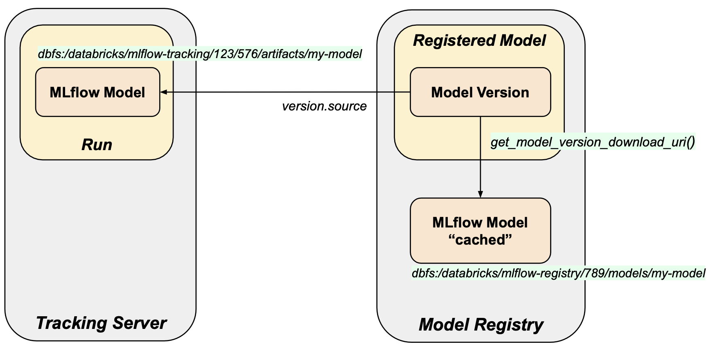

# mlflow-tool - Model version validation tools


## Overview

**Tools**
* [Compare model versions](#Compare-model-versions) - Compares two different model versions. The versions can be
either in the same or another tracking server (workspace). 
The registry models of each version are compared as well as their run models.
* [Check model version](#Check-model-version) - Validate a version's MLflow model. Checks that a model version's run model artifact (run_model) matches the cached model registry model (reg_model).

See [Databricks notebook versions](databricks_notebooks/check_version).

**Model Version and its MLflow models**

An MLflow model version has two sources of truth for the MLflow model it wraps:
* Run (run_model): MLflow model as a run artifact. 
The version has a field [source](https://mlflow.org/docs/latest/python_api/mlflow.entities.html#mlflow.entities.model_registry.ModelVersion.source) that points to the run's model artifact path.
* Registry (reg_model): "cached" version of above. Its path is obtained by the 
[MlflowClient.get_model_version_download_uri](https://mlflow.org/docs/latest/python_api/mlflow.client.html#mlflow.client.MlflowClient.get_model_version_download_uri) method.

In Databricks both MLflow models are DBFS paths:
* run_model: `dbfs:/databricks/mlflow-tracking/e090757fcb8f49cb9822f65f2fe7ed91/a3a68a4c68f642919430689c682b89c5/artifacts/my-model`
* reg_model: `dbfs:/databricks/mlflow-registry/6ec58d8b111f4869b361e7203d8860db/models/my-model`


**Model Version Diagram**



**Comparison Implementation Notes**

The standard Python [filecmp](https://docs.python.org/3/library/filecmp.html) module is used for comparison.
For MLflow model flavors whose native model format is one file (e.g. one pickle file for Sklearn) 
[filecmp.cmpfiles](https://docs.python.org/3/library/filecmp.html#filecmp.cmpfiles)  is used.
For other flavor whose native format is a directory (e.g. SparkML or TensorFlow), [filecmp.dircmp](https://docs.python.org/3/library/filecmp.html#filecmp.dircmp) is used.

A file/directory hash is also calculdated, but is included in the output only as a convenience. 
`filecmp` is the canonical comparison method.


## Compare model versions

* Compares two model versions. Checks that:
  * The "cached" registry models (pointed to by the `get_model_version_download_uri()`) are the same.
  * The run models are the same (pointed to by `version.source`).
* The model versions can be in different workspaces.

Source: [compare_model_versions.py](mlflow_tools/check_version/compare_model_versions.py).

Sample output report: [compare_model_versions.json](samples/check_version/compare_model_versions.json).

**Run example**
```
compare-model-versions \
  --config-file config.yaml \
  --download-dir /tmp/scratch_download  \
  --report-file compare_model_versions.json
```
```
. . .
Reg_Model_Comparison:
{   
  "equals": true,
  "tracking_server_1": {
    "path": "/tmp/scratch_download/reg_model/server_1/model/model.pkl",
    "hash": "3027220482473d3951e8cbf591943655"
  },
  "tracking_server_2": {
    "path": "/tmp/scratch_download/reg_model/server_2/model/model.pkl",
    "hash": "3027220482473d3951e8cbf591943655"
  } 
}   
Comparison_Summary:
{     
  "run_model": true,
  "reg_model": true
} 
```

**Configuration - config.yaml**
```
tracking_server_01:
  host: databricks://test_env
  model: Sklearn_Wine
  version_or_stage: staging
  native_model: model.pkl
tracking_server_01:
  host: databricks://prod_env
  model: Sklearn_Wine_Imported
  version_or_stage: staging
  native_model: model.pkl
```
Description:
* host - tracking server host
* model - registered model name
* version_or_stage - either the version number or stage (production, staging, archived)
* native_model - relative artifact path of the native model in the MLflow artifact.


**Options**

```
compare-model-versions --help

  Compare two model versions: check that the cached registry models are the
  same and the run models are the same.


Options:
  --config-file TEXT    Configuration file  [required]
  --download-dir TEXT   Download directory for artifacts  [required]
  --compare-run-models  Compare run models
  --compare-reg-models  Compare registered models
  --verbose             Verbose
```

## Check model version

Validate a version's MLflow model. Checks that a model version's run model artifact (run_model) matches the "cached" model registry model (reg_model).


Source: [check_model_version.py](mlflow_tools/check_version/check_model_version.py).

Sample output report: [check_model_version.json](samples/check_version/check_model_version.json).

**Run example**
```
check-model-version \
  --model Sklearn_Wine \
  --version-or-stage production \
  --download-dir /tmp/scratch_download  \
  --report-file check_model_version.json
```
```
. . .
{
  "equals": true,
  "run_model": {
    "download_uri": "dbfs:/databricks/mlflow-tracking/e090757fcb8f49cb9822f65f2fe7ed91/3c0b2decc41c4dc0becd3d60bc814a4d/artifacts/model",
    "local_path": {
      "path": "/tmp/scratch_download/run_model/model",
      "hash": "3a8c2e4dd75843b0e4cdb2aeb3b8ceade8fe9b73"
    }
  },
  "reg_model": {
    "download_uri": "dbfs:/databricks/mlflow-registry/4c27e4f25ad54488afc84b8cff227457/models/model",
    "local_path": {
      "path": "/tmp/scratch_download/reg_model/model",
      "hash": "3a8c2e4dd75843b0e4cdb2aeb3b8ceade8fe9b73"
    }
  }
}
Equals: True
```

**Options**
```
check-model-version --help

Usage: check-model-version [OPTIONS]

Validate a version's MLflow model. Checks that a model version's run model artifact matches the cached model registry model.

Options:
  --model TEXT             Registered model name  [required]
  --version-or-stage TEXT  Model version or stage  [required]
  --download-dir TEXT      Download artifact scratch directory
  --report-file TEXT       Output report file
```
